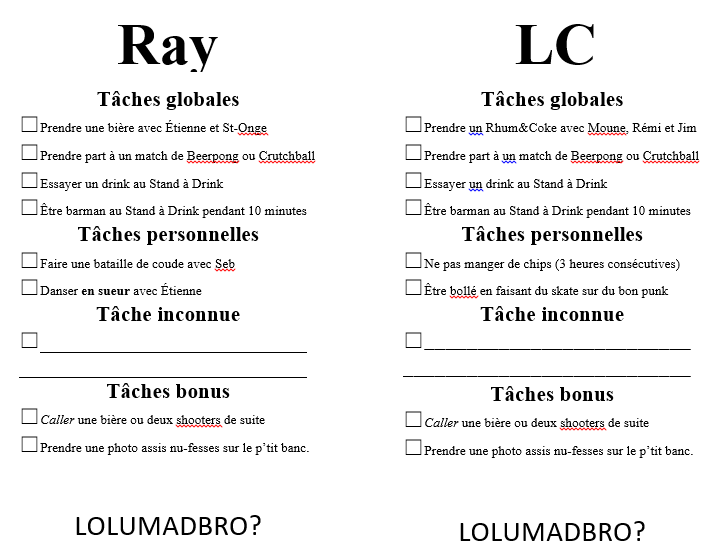

## Histoire du Jour de l'An 101

Cette page rassemble les éléments nécéssaire à votre apprentissage du **Jour de l'An**. Toutes informations spécifiées sur ce site est sujette à examen.

Le but de ce cours est d'expérimenter et de comprendre l'emsemble des tenants et aboutissants de cette célébration. Pendant 3 jours, nous revivrons ensemble la totalité de l'histoire des **Jour de l'Ans**.

## Plan de Cours

[Le plan de cours est disponible ici](plandecours.md). Nous vous invitons à vous familiariser avec celui-ci, il contient les informations importantes à la réussite de votre cours.

## Théorie du Jour de l'An

Veuillez consulter la page [Théorie du Jour de l'An](theorie.md) afin de vous familiariser avec les éléments de bases avant de poursuivre avec les lectures obligatoires.

---
## Lectures Obligatoire

### 1er Novembre 2019: Jour de l'An 2011 (1ere édition)

***Thème***: Aucun

***Nom***: Aucun

***Invitation***: [Vous retrouverez ici l'invitation de 2011.](jdl2011_invitation.md)

***Quiz***: Aucun

#### Informations pertinentes

Le JDL2011 fut la première édition de l'événement. Présentée à St-Célestin, cette version pilote du rendez-vous ne possédait aucun thème en particulier, mais jetais les bases de différents concepts qui deviendraient des incontournables au fil des ans:
- Habillement chic
- Événement sur deux jours
- Partie de hockey le 30 en après-midi
- Échange de cadeaux
- Le Potluck
- Le déjeuner aux pains dorés préparé par Maxime

#### Faits

On se souviendra de 2011 comme étant l'année où:
- Frank a rendu hommage à la chanson Chop Suey de System of a Down
- Moune a passé la soirée du 30 à l'urgence et le 31 sur les anti-biotiques. La légende dit que Frank a compensé le manque à boire de Moune, ce qui a causé sa perte.
- Moune a été grandement affecté par Geneviève qui danse trop proche et trop intense pour lui.
- Gaby a acheté une chaudière de soldat en plastique que Michel s'est mérité. C'était le début des cadeaux de marde au JDL.

---
### Jour de l'an 2012 (2ième édition)
En 2012, toujours pas de thème établi. On compte sur l'enthousiasme des gens pour mettre de l'ambiance, ce qui a porté fruit l'année précédente! Cette année marque l'apparition du concours de dégustation de vin, proposée par Karol-Ann, dont les problèmes d'alcool commencèrent dans ces dates-là.

Pour la deuxième édition, la piste de danse fut installée au sous-sol. Ce fut la seule année où l'expérience fut tentée.

#### Fun Facts
- Il semble que 2011 fusse l'année où on a commencé à se mettre du ketchup su'l chest, une tradition qui se perdit en 2012.
- Le 29 décembre 2012, un avertissement d'entrée de maison glacée fut envoyé. Comme quoi déjà à l'époque Moune n'était déjà pas un fervent déneigeur.
- On se souviendra que les shooters de glace n'étaient pas un franc succès.
- Cette année-là, Moune acheta le célèbre toutou de bacon qui disait "I'm Bacon". 20$ de shipping et 15$ de douanes plus tard, Seb le gagna et le crissa sans cérémonie dans son garde-robe, là où il ne vit plus jamais le jour.
- La légende dit qu'une bouteille d'eau très forte circula en 2012.

#### Lien utiles

Vous retrouverez ici l'[invitation de 2012](jdl2012_invitation.md).

---
### Jour de l'an 2013 (3ième édition)
On se souvient tous de 2012 comme étant l'année où on est pas mort, malgré ce qu'en disait les Mayas. Cette grande chance fut l'inspiration du tout premier thème officiel: Les Mayos! Pour l'occasion un courriel d'invitation fut envoyé et ce fut également le début des sites internets créés pour le jour de l'an. Bien que les sites n'existent plus, vous en trouverez le contenu en ces pages.

Quelques ajustements qui furent apportés pour 2013 figurent encore dans les Jour de l'Ans d'aujourd'hui. Entre autre, c'est cette année-là que le premier tournoi du Jour de l'An eu lieu. On parle ici du tournoi de Crutchball, qui fut remporté par Etienne, et non Jérémie. Il va de soit que c'est en 2013 que le trophée du Jour de l'An fut inauguré!

2013 fut également l'année avec le plus de décoration au Jour de l'An. La raison étant bien simple, le party de job de Moune ayant exactement le même thème, il a volé la moitié des décorations là-bas.

jdl2013_gilet.md

#### Fun Facts
- En 2013, le populaire bar fut installé devant l'ascenseur. On se souviendra que Steph fut une barmaid hors-pair.
- Le tournoi de Crutchball fut un bon moment pour tous, sauf pour tous ceux qui se sont luxé l'épaule.
- Comme prémisse au JDL2013, un courriel fut envoyé à chaque mois afin de faire le décompte des mois restant avant l'événement.
- En plus de l'invitation, fut dévoilé aux participants entre le 1er novembre et le 30 décembre 7 prédictions provenant du prophète Hellmann!
- Les plus nostalgiques se rappelleront que depuis 2011, Grooveshark était le DJ officiel du JDL. RIP Buddy.
- Le 31 au soir, un carton par participants fut remis, lequel contenait des tâches à réaliser en cours de soirée. Un défi de taille que bien peu peuvent se vanter d'avoir terminé! Voici en exemple deux cartes.

- Comme vous pouvez le constater ci-haut, cette année-là, le défi de s'asseoir nu-cul sur le *p'tit banc* fut lancé!
- Splasher la bolle?

#### Lien utiles

Vous retrouverez ici l'[invitation de 2013](jdl2013_invitation.md).

#### Site internet
- [La Civilisation Mayo](jdl2013_civilisationmayo.md)
- [Prédiction #1: Échange de cadeau](jdl2013_prediction1.md)
- [Prédiction #2: Habillement](jdl2013_prediction2.md)
- Prédiction #3: La prédiction fut perdue, mais elle consistait à pouvoir prendre des photos sur son téléphone et les envoyés sur la télé.
- [Prédiction #4: Tournoi de Crutchball](jdl2013_prediction4.md)
- [Prédiction #5: Stand à Drink](jdl2013_prediction5.md)
- [Prédiction #6: Musiqueziquezique](jdl2013_prediction6.md)
- [Prédiction #7: Tâches à réaliser](jdl2013_prediction7.md)

#### Prédiction des participants
Les participants furent invités à faire leurs propres prédictions. Voici les meilleures:
- Il va y avoir des chests partout (Moune)
- Au moins la moitié des gense vont avoir quelque chose dans leur culotte (Gaby)
- Étienne va vraiment être désagréable (Etienne)
- Moune sera proche de ses émotions après 3 verres (Freud)
- Moune sera proche de ses émotions après 2 verres (Freud 2)
- Karo va encore nous parler de comment elle aime le Beaujolais (SAQ)
- M'a me faire parler de comment j'étais chaud v'la 2 ans (Frank)
- Y'a quelqu'un d'autre qui va avoir la ''bonne'' idée de boire des shooters dans des verres en glace (Seb)

---
### Jour de l'an 2014 (4ième édition)
2014 marque une autre grande étape dans le développement de l'invitation du Jour de l'An. Inspiré des Jeux Olympiques de Sotchi, le thème Les Jourdelanpiques est choisi. L'événement verra apparaître encore quelques classiques qu'on reconnait toujours aujourd'hui. Tout d'abord, instauration du Quiz Pré-JDL, un jeu d'association où les résultats sont toujours sous la note de passage, dont le gagnant se mérite un point bonus à la dégustation de vin. 

D'ailleurs, ladite dégustation de vin offre maintenant au vainqueur de séjourner dans la chambre d'amis pour la durée du JDL, un prix qui vaut son pesant d'or, ou pas!

Le photobooth fait aussi son apparition au JDL2014, avec ceux qui deviendront ses alliés de toujours, les tatouages temporaires! 

#### Fun Facts
- C'est cette année-là que Maxime Dupont vécu une grande déception: aucun fromage sur sa poutine de chez Roy et Diane.
- Lors du quiz, les participants devaient créer un pays fictif. Le pays de Jean-Gabriel? Le Kazakhstan. Même pas foutu d'inventer un pays qui existe pas! [Vous retrouverez ici quelques drapeaux qu'on a pu admirer lors du JDL.](jdl2014_drapeaux.md)
- C'était peut-être à cause de leur trop grandes jambes ou de leur consommation d'alcool, quoiqu'il en soit, LC et MC ont défoncé la porte du garde-manger lors de la soirée du 31.

#### Lien utiles

Vous retrouverez ici l'[invitation de 2014](jdl2014_invitation.md).

#### Proposition de sports de démonstration
Les participants avaient la chance de proposer un sport de démonstration qu'ils aimeraient voir apparaître aux Olympiques. Voici les meilleurs:
- Ketchup su'l Chestathlon (Moune)
- La neige synchronisée (Michel)
- Le 100 mètres jeans baissées (LC)
- Gosser Laroche (Etienne)

---
### Jour de l'an 2015 (5ième édition)
Voyant la crise de la trentaine approchée à grand pas, Moune s'en inspire en 2014 afin de choisir le thème Le Jour de l'HEEENNN? C'est dans l'ambiance d'une maison de retraite qu'il recevra les gens cette année-là.

Peu de gens le remarquère à l'époque, mais plusieurs courriels préparatoire furent envoyés avant le 1 novembre 2014. Dans la lignée du "Peux-tu deviner le thème" de l'année précédente, 4 messages sont envoyés afin de faire la promotion du thème de 2015. [Vous pouvez les consulter ici](jdl2015_courriels.md).

Le Tournoi Coeur d'Enfant est la compétition officielle de ce JDL. Un des tournois préférés de Moune, particulièrement l'épreuve d'identification des émissions jeunesses. On ose croire que les gens ont eu autant de plaisir à le faire que Moune à le créer.

#### Fun Facts
- C'est cette année-là que fut lancée l'idée de veiller jusqu'au lever du soleil. Qu'elle criss d'idée de marde.
- Après des performances inspirées de Frank, Geneviève, Laurie et Stéphanie, ce fut le tour de Seb d'être magané en maudit. Être couché avant le décompte de la nouvelle année, faut le faire, on lui lève notre chapeau.

#### Lien utiles

Vous retrouverez ici l'[invitation de 2015](jdl2015_invitation.md).

---
### Jour de l'an 2016 (6ième édition)
Comme 2015 avait été le théâtre de deux mariages dans la gang, il allait de soit qu'on devait respecter le proverbe "Jamais deux sans trois". C'est donc pour cette raison que fut préparé le *Mariage de Yolande et Roger*. Pour la seule fois de l'histoire, aucun courriel ne fut envoyé le 1 novembre. L'invitation se fit plutôt par courrier, comme les vrais mariages le font, afin de respecter la tradition. 

Rendu à la 6ième édition, les bases étaient pas mal jetées et rien de bien nouveau ne fit son apparition. L'invitation officielle était donc toujours sur un site internet, tout comme le pré-quiz.

Avec un thème rendant hommage à l'amour, il allait de soit que ça prenait un un site de rencontre! Ce fut donc le thème du préquiz, [disponible ici](jdl2016_quiz.md).

#### Fun Facts
- Le tapis rouge d'OD a fait une apparition lors de la sélection des équipes pour le tournoi Oréo & Joliette. Il est ensuite retourné dans la salle de bain du sous-sol.
- Un *shitload* de bagues étaient disponbiles afin de demander la main de nos ami(e)s, dans la plus grande tradition de la Polygamoune.
- Cette année-là, un concours de photo du photobooth fut organisé. Le gagnants furent Vincent et Maxime qui reçurent une voiture (miniature)!

#### Lien utiles

Vous retrouverez ici l'[invitation de 2016](jdl2016_invitation.md).

---
### Jour de l'an 2017 (7ième édition)
Devant la quantité d'enfants qui prolifèrent devant nos yeux, il allait de soit qu'une thématique *garderie* voit le jour! Mais pas n'importe quelle garderie, non! Celle de l'enfant de plusieurs d'entre-nous, avec une *twist* de théorie du complot. Rien de mieux!

Sous l'oeil averti du Grand Moumou ([dont les représentations graphiques du quiz nous perturbent encore à ce jour](jdl2017_sw_moumou.md])), cette édition présenta un site web beaucoup trop intense:

- [Accueil](jdl2017_sw_accueil.md)
- [Portes ouvertes](jdl2017_sw_po.md])
- [FAQ](jdl2017_sw_faq.md])
- [Films pour enfants](jdl2017_sw_films.md])
- [Films pour enfants](jdl2017_sw_moumou.md])

#### Fun Facts
- 

#### Lien utiles

Vous retrouverez ici l'[invitation de 2017](jdl2017_invitation.md).

---
### Jour de l'an 2018 (8ième édition)
Après plusieurs années à présenter le thème par un site internet, changement de direction en 2017. Une page facebook est créée afin de faciliter les communications. Le courriel d'invitation du 1 novembre se lit d'ailleurs comme suit:

    C'T'ANNÉE ON L'FAIT SU FACEBOOK! YESSERS!
    
De la poésie.

Un thème salon du livre

#### Fun Facts
- Une quantité limitée de personnes ont compris qu'ils fallaient offrir un livre pendant le cadeau d'échange.

#### Lien utiles

Vous retrouverez ici l'[invitation de 2018](jdl2018_invitation.md).

---
### Jour de l'an 2019 (9ième édition)

Après une année sous le signe de la culture littéraire, 2019 alla vers un penchant plus télévisuel!

#### Fun Facts
- Une quantité limitée de personnes ont compris qu'ils fallaient offrir un livre pendant le cadeau d'échange.

#### Lien utiles

Vous retrouverez ici l'[invitation de 2019](jdl2019_invitation.md).

