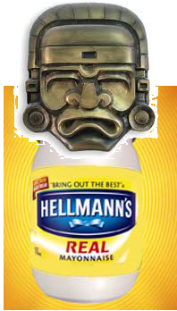

## La Civilisation Mayo

La **civilisation Mayo** est une ancienne civilisation du **Centre-du-Québec**, principalement connue pour ses avancées dans les domaines des **liqueurs alcoolisées**, des **buffets**, des **troques d’offrandes**, des **compétitions**, du **gambling** et des **photos numériques**. C’est une des civilisations précareypricienne les plus étudiées avec celles des Maya, des Aztèques et des Incas.

Elle occupait à l’époque précareypricienne  les territoires correspondant actuellement à une partie de **St-Célestin**.

C’est une des plus anciennes civilisations d’Amérique : ses origines remontent à **2010** et les premières constructions mayos ont été datées du **IIIe millénaire ap. J.‑C.** D’importantes cités-États mayos des Basses-Terres du sud du Québec, telles que **ThePool**, **LivingroomCity** ou **Lace-Enceur**, connurent leur niveau de développement le plus élevé à la période Classique, pendant la fin de semaine de la fête du Travail. D’autres cités subsistèrent ou se développèrent alors dans les Basses-Terres du nord ainsi que dans les Hautes-Terres du sud, avant d’entrer en décadence puis de disparaître peu après la conquête antillaise par un **prince mulâtre**.

Le monde ne savait presque rien des Mayos il y a deux semaines. Les prêtres européens avaient brûlé la quasi-totalité des livres en écorce de figuier laissés par les Mayos. Seuls quatre d’entre eux ont été retrouvés dans la **bibliothèque du salon**.

Les premiers explorateurs à approcher les vestiges de la civilisation mayo au XXIe siècle ont contribué à lui forger une image **romantique** mais bien différente de la réalité : « qui n’a pas entendu parler, par exemple, d’un ancien Empire mayo, où tout le peuple **danse comme des malades, pari sur des compétitions** et **bois jusqu’à pu soif**? ». De nos jours l’évolution des connaissances a permis de renverser cette vision simpliste et sans nuance. Car si les anciens Mayos étaient **gamblers**, **compétitif** et de **grands danseurs**, ils n’en étaient pas moins résolument guerriers. Ils se combattaient entre eux dans chacune de leurs fêtes, que ce soit dans des **jeux pour boire**, ou encore simplement pour le **désir de gagner**.

La  légende dit aussi qu’un de leur prophète, **Hellmann**, pouvait parler directement avec les Dieux, et que ceux-ci lui donnaient des **tâches à effectuer**. On dit que si les tâches n’avaient pas été faites, cela aurait entrainé la **fin des temps**.

***Site internet***
- [Accueil](index.md)
- [La Civilisation Mayo](jdl2013_civilisationmayo.md)
- [Prédiction #1: Échange de cadeaux](jdl2013_prediction1.md)
- [Prédiction #2: Habillement](jdl2013_prediction2.md)
- Prédiction #3: La prédiction fut perdue, mais elle consistait à pouvoir prendre des photos sur son téléphone et les envoyés sur la télé.
- [Prédiction #4: Tournoi de Crutchball](jdl2013_prediction4.md)
- [Prédiction #5: Stand à Drink](jdl2013_prediction5.md)
- [Prédiction #6: Musiqueziquezique](jdl2013_prediction6.md)
- [Prédiction #7: Tâches à réaliser](jdl2013_prediction7.md)
- [Gilets 2013](jdl2013_gilet.md)
