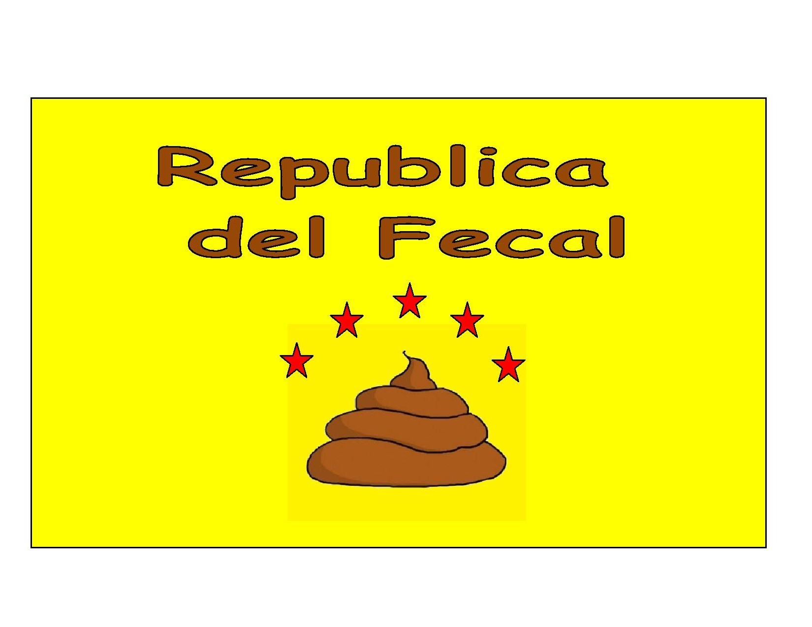
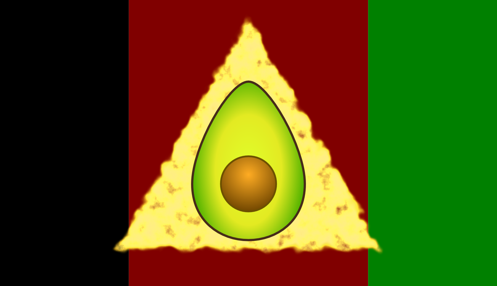
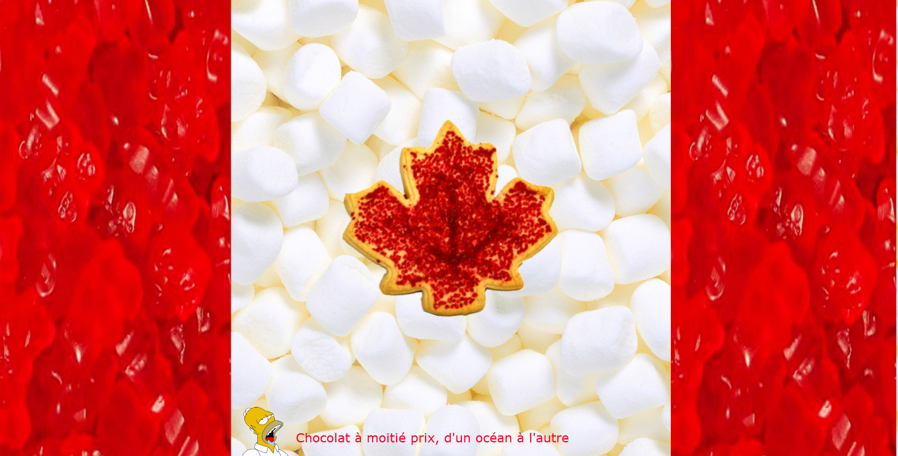

## Drapeaux 2014

Voici quelques un des drapeaux de pays présents lors des **Jourdelanpiques**.

***Le Karomoune***

***La Republica Del Fecal***

***La Republica di Guacamolia di Tortilla***

***Sugerland***

