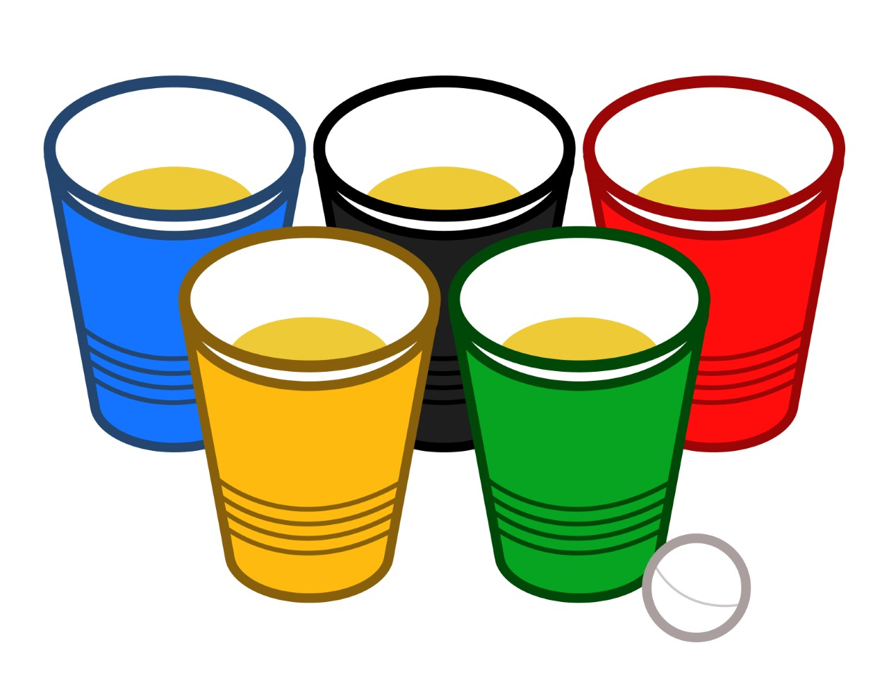
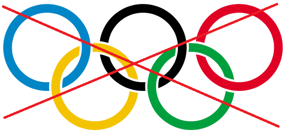

## Invitation 2014

### Le 30 Octobre 2013, comme préambule à l'invitation de 2014, un petit jeu fut envoyé demandant aux gens de deviner le thème à partir de l'image suivante.

### L'invitation de 2013 fut envoyée par courriel le 1 novembre 2013. 

Chers distingués destinataires de ce e-mail,

Il y a environ 10 mois, le grand prophète Hellmann nous a laissé un commandement rempli de sagesse qui allait comme suit :

***Prier jusqu’au premier novembre 2013 en espérant être invité au jour de l’an 2014***

Avez-vous prié?
Allez-vous être invité?
Aviez-vous vraiment besoin de prier?
Y aura-t-il un Jour de l'an en fait?
Avez-vous deviné le thème du Jour de l'an (cette question répond un peu la question précédente...)
Qui veut la peau de Roger Rabbit?

### Évidemment, le vrai texte d'invitation se retrouvait sur le site internet du JDL

Très chères et très chers bros,

Grosse nouvelle dans le monde du sport! Après sa nomination comme président du CIO, [Thomas Bach](https://fr.wikipedia.org/wiki/Thomas_Bach) a pris sa première grande décision. Il a décidé de créer une version plus festive des Jeux olympiques, qui pourrait être présentée à chaque nouvel an! Il s’agit d’un évènement préparatoire aux vrais Jeux olympiques, présenté dans le but de garder l’intérêt des gens au plus au niveau en attendant Sotchi 2014 et les jeux subséquents. Évidemment, le but ici est d’organiser des Jeux qui montreront que c’est possible de ne pas dépasser le budget, d’avoir toutes les infrastructures sportives à temps et de ne causer aucun désastre écologique (Fail la Russie! Et Montréal. Et Londres. Et pas mal tout le monde finalement).

Comme vous le devinez probablement, avec l’organisation de 3 jours de l’an derrière la cravate, M.Bach a pensé à moi pour l’organisation de ces Jeux! J’ai donc hérité de la tâche de voir à la préparation et la présentation des nouveaux Jeux olympiques, et j’ai nommé :

***Les Jours Delanpiques!***

Il va sans dire, ces Jeux devant être présentés dans la plus grande tradition olympique, aucun détail n’a été négligé! Chacun des éléments clés qui caractérisent l’esprit olympique ont été identifiés, puis intégrés à mon évènement. Un succès assuré!

Vous vous dites certainement « Weyons asti, de kécé qui parle sacrâment, j’me côlisse de cé criss de jeu de marde. Laisse-moé don regorder des châts su intérnette. »

Et là vous vous demandez « Coment ço qui cé exactément ske j’pense??? ».

Revenons-en au but premier de mon message. Pour pouvoir présenter de tels Jeux, j’ai besoin d’athlètes provenant d’une multitude de pays; des hommes et des femmes entraînés à boire, qui peuvent danser pendant des heures sans s’épuiser et qui peuvent garder un niveau élevé de coordination et de dextérité tout en enfilant un shooter après l’autre.

Et c’est pourquoi j’ai pensé à vous! Pour la première édition des Jours Delanpiques, j’ai décidé de garder l’international un peu plus local et je vous annonce donc que vous êtes tous invités à être mes athlètes et à former mes pays! Chacun de vous, que ce soit seul, ou avec votre blonde/chum, êtes invités à **créer un pays que vous représenterez pendant les Jours Delanpiques**. Cela implique de trouver :

- Nom de votre pays
- Drapeau de votre pays (sur feuille de papier, imprimé ou dessiné, ou tout autre moyen moins cheap que le papier!)
- Repas typique de votre pays pour le buffet du 31
- Un présent par personne de votre délégation d’une valeur de 25$ pour l’échange de cadeau

Afin de bien expliquer tout le déroulement des Jours Delanpiques et d’en saisir l’esprit dans son entièreté, en voici les grandes lignes.

~~PLUS VITE, PLUS HAUT, PLUS FORT~~

PLUS VITE, PLUS CHAUD, PLUS DE FORT

#### PRÉSIDENT D’HONNEUR

La première édition des Jours Delanpiques est fière d’avoir comme président d’honneur, nul autre que le [Baron Pierre De Coubertin, rénovateur des Jeux olympiques de l’ère moderne!](https://fr.wikipedia.org/wiki/Pierre_de_Coubertin)

On lui doit la devise olympique Citius, Altius, Fortius, remis au goût du jour ci-haut, et l’adoption de la maxime olympique :

    L’important dans la vie n’est pas de vaincre mais de lutter. L’essentiel n’est pas d’avoir gagné mais de s’être bien battu.

Dans notre édition des Jeux, cette maxime ne sera pas endossée, car le comité organisateur considère que c’est une « esti de quote de loser ».

**Décédé en 1937**, M. De Coubertin de ne sera malheureusement pas présent. Il sera cependant représenté par un de ses descendants, **M. Bière De Coubertin**.

#### CÉRÉMONIE D’OUVERTURE

La **cérémonie d’ouverture** des Jours Delanpiques aura lieu **lundi le 30 décembre 2013, vers 13h**, à St-Célestin. Les délégations de chacun des pays représentés feront leur entrée dans le stade olympique (le salon) guidé par leur porte-drapeau. D’ailleurs pendant la soirée du 31 décembre, **un prix pour le meilleur drapeau sera remis**.

Des frais d’inscription seront demandés aux athlètes, étant donné le non-budget attribué aux Jeux. On demandera **10$ + 5$** pour une participation à la dégustation de vin. (À confirmer!)

Suivra ensuite l’arrivée des athlètes dans le **village olympique** qui les hébergera pour la durée de l’évènement: La cave. Le village olympique accueillera une compétition plus tard en soirée, donc il est possible que les installations des athlètes doivent être déplacées à ce moment.

Lorsqu’une bonne majorité d’athlète seront arrivés au stade, le pays hôte procédera à l’**allumage de la flamme olympique**!

#### GRANDE FINALE OLYMPIQUE DE HOCKEY SUR GLACE (MIXTE)

En après-midi, tous les athlètes sont convoqués à l’aréna officielle du tournoi de hockey sur glace pour la **présentation du match final**. Sur cette patinoire extérieure aux dimensions non-olympiques devrait avoir lieu un des plus grands matches de l’histoire du hockey, une partie dont on se souviendra longtemps! Voici enfin votre chance de vous prendre pour Sydney Crosby et marquer le but gagnant en prolongation!

#### REPAS POUR LES ATHLÈTES

Après le match, les joueurs pourront commander un repas au distingué restaurant **Roy et Dianne International**. Il ne devrait pas avoir de problème si vous désirez du fromage sur votre frite-sauce, sauf pour Max Dupont. Il sera important de bien manger pour récupérer ses énergies avant le tournoi officiel d’un sport à l’essai.

Effectivement, avant de l’intégrer à Sotchi, le **Beerpong doit passer par le statut de sport de démonstration** ici aux Jours Delanpiques!

#### DÉGUSTATION DE VIN INTERNATIONAUX

Avant le grand tournoi de Beerpong, les athlètes seront conviés à un moment détente où ils pourront déguster des alcools provenant de partout dans le monde. Pour ajouter à l’agrément, ils pourront **tenter de deviner les vins qu’ils consomment**, dans le but de remporter un prix des plus prisé : la suite royale du village olympique.

#### TOURNOI OLYMPIQUE DE BEERPONG

Le tournoi aura lieu dans le village olympique et opposera des équipes de deux joueurs qui s’affronteront dans le but de monter sur la plus haute marche du podium. Après le tournoi, une **cérémonie de remise des médailles avec l’hymne national** de l’équipe gagnante aura lieu.

Pour une plus grande équité, les équipes seront **formées au hasard**. Donc l’organisation des Jours Delanpiques espère avoir un **maximum de participants**, c’est-à-dire tout le monde! Le tournoi obéira aux règles non-officielles qui sont en usage depuis le début de l’année 2013. Un juge sera affecté à chaque match et nous allons faire notre possible pour que la corruption soit à son niveau le plus bas.

Dans l’optique de garder les athlètes dans une forme optimale pour la soirée du 31, **l’alcool ne sera pas obligatoire** lors du tournoi. Avant chaque match, **chacune des équipes annoncera si ses membres consommeront ou non de l’alcool pendant le match**. Les puristes pourront donc boire dans les règles de l’art, tandis que les néophytes pourront s’initier au sport sans en subir les contrecoups le lendemain. C’est une décision difficile à prendre pour le comité organisateur, mais cela est nécessaire si on désire avoir la participation de tout le monde.

Le tournoi sera sous la forme **double-élimination**. Il sera joué au son de la chanson de **Mortal Combat** et la finale sera filmée pour la postérité. De plus, sera à l’enjeu dans le tournoi un **fabuleux trophée**!

Après le tournoi, les athlètes seront libérés de toutes obligations pour le reste de la soirée. Un repos bien mérité sera de mise, que ce soit immédiatement après le tournoi ou plusieurs heures plus tard.

***Avertissement pour le village olympique***

Historiquement, le village olympique est un endroit propice aux rapprochements entre athlètes, et nous aimerions donc vous mettre en garde contre cette fâcheuse tendance.

Prière de ne pas avoir de rapprochement avec les athlètes des autres pays. L’ONU nous a prévenus que cela pouvait nuire aux relations internationales. En ce qui concerne vos compatriotes, nous aimerions que vous vous absteniez de franchir la ligne que nous aimons appeler dans le jargon **Le Frank**. Essayer de remonter la jupe de sa blonde, ben chaud, c’est pas mal le maximum qu’on peut tolérer.

#### DÉJEUNER HAUTE GASTRONOMIE

Le déjeuner du 31 au matin sera cuisiné par le **grand chef MaxDu**, reconnu pour son mélange à crêpes succulent et sa dextérité légendaire des pains dorés. Un bon repas équilibré en vue de cette grande journée de compétition!

En cas d’absence du grand MaxDu (ou en cas de refus de sa part de cuisiner!) un chef alternatif sera désigné au hasard. Un délice assuré.

#### DÉTENTE ET PRÉPARATION

Les autres compétitions olympiques ayant lieu de soir, la journée du mardi 31 décembre 2013 sera réservée à la préparation des repas pour la compétition du buffet.

Une reprise de la finale de hockey sur glace pourrait avoir lieu en cas de corruption des juges de ligne dans le match de la veille.

#### BUFFET INTERNATIONAL

Pour le buffet, les délégations sont conviées d’amener **un plat typique de leur pays**. Tout le monde en sera quitte pour des saveurs multiculturelles mémorables!

#### HORAIRE DES COMPÉTITIONS EN SOIRÉE

Voici un **horaire approximatif des compétitions de la soirée du 31**. Comme tous bons Jeux olympiques, les compétitions de bases doivent être jouées et elles le seront! Cependant, elles ont été ajustées en fonction des Jours Delanpiques. Voici la [liste des compétitions officielles](https://fr.wikipedia.org/wiki/Jeux_olympiques_d%27hiver#Disciplines_sportives_actuelles) accompagnées de leur penchant jourdelanpique :

- 17h00 : Biathlon / Bièreathlon
- 18h00 : Combiné nordique / Combiné de viande froide nordique
- 19h00 : Patinage artistique / Potinage artistique
- 20h00 : Luge / Tequiluge Bang Bang
- 21h00 : Patinage de vitesse sur courte piste / Patinage de vitesse sur courte piste de danse
- 22h00 : Hockey sur glace / Le hockey va déjà avoir été joué le 30, mais ça se peut qu’on prenne une couple de SHOTS quand même
- 23h00 : Ski alpin / Ski alpinte de bière
- 00h00 : Patinage de vitesse / Patinage « d’eau de vie »tesse
- 01h00 : Bobsleigh / Lichi bombsleigh
- 02h00 : Ski acrobatique / Whiskey acrobatique
- 03h00 : Skeleton / Où Sk’el es’ton drink?
- 04h00 : Curling / Mal de Coeurling
- 05h00 : Snowboard / Sn’au bord’de vomir
- 06h00 : Saut à ski / Sceau à ski ressort de ton estomac
- 07h00 : Ski de fond / Ski de fond de tonne

***Avertissement***

Comme on peut le voir dans les compétitions, une bonne dose d’alcool sera engloutie. Merci de faire attention pour ne pas vous blesser sérieusement pour que ces Jeux olympiques **ne deviennent pas les Jeux paralympiques**.

#### ACTIVITÉS CONNEXES ET INFORMATIONS SUPPLÉMENTAIRES

***Habillement lors des compétitions du 31 au soir***

Nous demandons aux athlètes de se présenter au stade en **tenue chic en plus d’être ‘ben swell**.

***Activités complémentaires du 31 au soir***

À quelque part entre les compétitions susmentionnées, un autre sport de démonstration nommé « **Échanges de produits locaux entre dignitaires des pays représentés** » sera présenté. D’une valeur de **25$**, les membres des délégations doivent apporter un présent provenant de leur pays qui pourra être sélectionné et volé au cours d’un échange des plus endiablé!

Avant que le « Patinage sur courte de piste de danse » s’entame juste après, nous aimerions que le buffet soit libéré de la table du stade, sans toutefois bloquer le comptoir de la cuisine du pays hôte. Juste enlever vos choses et les laisser dans le **chinatown olympique** (garage) pour les ramasser plus tard au pire. La table et le comptoir seront nécessaires plus tard dans la soirée.

***Présentation continue des faits saillants***

Grâce à nos talents de négociateurs, nous avons obtenu **les droits de télédiffusion exclusifs** pour les Jours Delanpiques!

Tout au long de la compétition, les faits saillants seront donc affichés sur l’**écran géant du stade**. Contrairement à Sotchi qui interdit les images prises par smartphones, les athlètes sont priés d’apporter leur **téléphone avec dropbox** afin de partager leurs propres clichés sportifs. On espère que l’honorable Gab St-Onge apportera son appareil photo avec sa carte wifi (ou qu’il prêtera sa carte!).

*Note : Comme nous organisons seulement des petits Jeux olympiques, il est normal que nous n’ayons qu’un petit écran géant de 42 pouces.*

***Décompte du 1er janvier***

Comme tout bon 31 décembre, il sera de mise de célébrer l’arrivée de 2014 par un **décompte des plus fou**! S’en suivra ensuite des souhaits et échanges entre pays tel que:

- Système de santé de qualité
- Succès dans le système d’éducation
- Une p’tite blonde (ou chum).

Un **délicieux mousseux** sera de mise lors des échanges de souhaits!

***Tests Antidopages***

Des contrôles antidopages aléatoires auront lieux tout au long de la compétition pour éviter la tricherie lors des épreuves. Une toilette sera disponible dans le village olympique et le pays hôte demande aux athlètes de fournir un échantillon chaque fois que vous devez l’utiliser. Les échantillons liquides devront être remis à Rémi Duhaime et les solides à Jérémie Aubé, expert et passionné du domaine. **Prière de ne pas splasher le bol de toilette**.

***Zone de manifestation***

À l’instar de Sotchi qui aura une zone spéciale où les gens pourront manifester, le pays hôte aura un espace réservé pour les hippies qui voudraient revendiquer des choses avec des pancartes et des slogans de cul. La galerie en arrière du stade permettra l’expression de vos opinions, en autant que la porte entre les deux demeure fermée. Le comité organisateur souhaite de tout cœur deux choses :

- Que votre liberté d’expression soit respectée
- Qu’il fasse à peu près -53°C avec le facteur vent pendant l’évènement

***Divertissement Audio***

Pour favoriser le twerking au cours de la soirée, un **DJ de renommée mondiale** a été engagé pour faire jouer de la musique provenant des quatre coins du monde. Les demandes spéciales pourront être faites directement à **DJ Grooveshark**.

***Bar et Alcool***

Les athlètes sont invités à apporter leur **alcool**. Par contre, un bar fournissant **des sides pour faire des drinks sera aussi aménagé** dans le stade afin d’avoir une bonne diversité de boissons. Si le cœur vous en dit, vous pouvez même vous improviser barman!

***Défis et Prix***

Afin de maximiser l’esprit olympique et de favoriser les liens internationaux, **un jeu sera proposé aux délégations tout au long de la soirée du 31**. Une **boîte surprise** sera installée au centre du stade et les athlètes pourront aller piger à l’intérieur de celle-ci. Qu’y trouveront-ils? Des bouts de papier sur lesquels on pourra retrouver :

- Des tâches diverses allant de la danse à la consommation d’alcool, ou…
- Rien, ou…
- Un prix en argent à la SAQ!

Plusieurs prix seront à l’enjeu pour inciter la participation. Êtes-vous prêts à relever le défi?

Les gagnants du jeu "Peux-tu deviner le thème?" se méritent le droit de piger **un** papier dans la boîte surprise et de donner la tâche à quelqu’un d’autre si le billet n’est pas gagnant!

***Souvenirs***

Pour que les athlètes puissent garder un bon souvenir des Jours Delanpiques, un **photobooth** sera mis en place dans le stade. Les photos seront ensuite diffusées sur l’**écran géant**. Vous êtes invités à utiliser le photobooth avec discernement pour garder les relations internationales en bon terme!

D’ailleurs, **les délégations sont invitées à prendre une photo avec leur drapeau**.

De plus, un petit élément surprise sera offert dans le stade pour que **les souvenirs soient encore plus mémorables**! Il sera indiqué en temps et lieu.

#### CÉRÉMONIE DE CLÔTURE

Le 1er janvier 2014 au matin, la cérémonie de clôture verra les délégations retourner vers leur pays d’origine. Cependant, afin de témoigner de leur appréciation, les athlètes seront invités à participer à différentes **activités promotionnelles**:

- Passer la balayeuse dans le village et le stade olympique
- Remettre les meubles du pays hôte aux bons endroits
- Ranger le système de divertissement audio.
- Ramasser les bouteilles
- Ramasser les traineries de tout genre

Malgré l’effort intense des athlètes pendant leurs compétitions de prédilection, ils sont invités à ramener leurs bouteilles vides/pleines (ou au moins les mettre eux-mêmes dans le bac). Le pays hôte vous en sera éternellement (de manière temporaire) reconnaissant.

#### CONCLUSION

Nous espérons une grande participation à cette première édition des Jours Delanpiques et nous souhaitons de tout cœur qu’aucun **mouvement de boycott** ne soit organisé d’ici le 30 décembre. Au plaisir de vous y voir représenter votre pays!

Si vous avez des questions pour le comité organisateur, vous pouvez les poser sur la FAQ, ou encore par e-mail.

## Texte d'accueil du site interet

Bienvenue sur le site officiel des Jours Delanpiques 2014!

Voici un petit résumé des trois jours de compétitions qui arrivent :

### 30 Décembre :

- Cérémonie d'ouverture : Arrivée des pays à partir de 13h
- Grande finale de hockey mixte
- Souper chez Roy et Dianne International
- Concours de dégustation de vin pour l'obtention de la suite royale du village olympique
- Sport de démonstration : Tournoi de Beerpong
- Plaisirs olympiques

### 31 Décembre

- Déjeuner du grand chef MaxDu
- Préparation mentale et alimentaire pour la soirée
- Buffet des continents
- Échange de cadeaux multiculturel
- Party olympique

### 1 Janvier

- Ménage olympique
- Cérémonie de clôture : Départ des délégations vers leur pays d'origine

Au plaisir de vous y voir!

## FAQ

Si vous avez des questions pour le comité organisateur, vous pouvez les mettre en commentaire ici, ou les envoyer par e-mail.

**Pourquoi des drapeaux?**

Pour faire de la décoration dans place et mettre de l’ambiance.

**Comment fonctionne le quiz pour les pays?**

Vous envoyez à Moune votre pays (et le drapeau s’il est prêt) avant le 15 décembre. Ensuite, parmi tout ceux qui ont envoyé leur pays, il y aura un quiz pour deviner les pays des autres. Le gagnant aura droit à un point boni lors de la dégustation de vin qu’il pourra garder, donner ou vendre au plus offrant.

**Comment fonctionne les contributions au buffet?**

Une contribution par couple, comme l’année passée.

**Comment fonctionne l’échange de cadeau?**

Un cadeau par personne qui participe, d’une valeur de 25$.

**Combien ça coûte?**

10$ + 5$ pour participer à la dégustation de vin. (À confirmer!)

**Comment fonctionne le Beerpong**

Équipe de deux. Équipe tirée au hasard avant le tournoi. Format double-élimination. Mortal Combat.

**Est-ce que Jean-Gabriel Pothier va être présent?**

lol.

**Est-ce que le Mini-Bar fonctionne comme l’année passée?**

Oui.

**Qui veut la peau de Roger Rabbit?**

Le baron von Rotton alias le Juge DeMort.

## Proposition de sports de démonstration
Les participants avaient la chance de proposer un sport de démonstration qu'ils aimeraient voir apparaître aux Olympiques. Voici les meilleurs:
- Ketchup su'l Chestathlon (Moune)
- La neige synchronisée (Michel)
- Le 100 mètres jeans baissées (LC)
- Gosser Laroche (Etienne)
