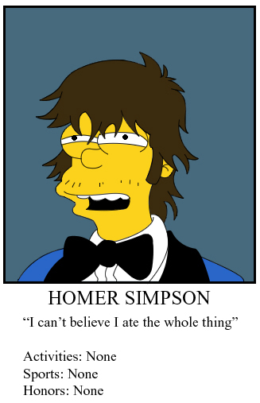

## FAQ

**FAQ**, **F**aut **A**mener **Q**uoi?

En résumé!

### Ce que vous devez faire

- Votre inscription.
- Indiquer votre élément du buffet.
- M’envoyer une photo de vous dans le style permit de conduire avec sourire.
- M’envoyer la réponse pour les quatre lignes (vous pouvez inventer ou dire des vraies affaires).
  - Citation : De vous, de quelqu’un d’autre, ou inventée.
  - Activités : Vraies ou inventées.
  - Sports : Vrais ou inventés.
  - Honneurs : Vrais ou inventés.

Voici des exemples:

**Citation**: « La nuit porte… porte… de garage! »

**Activités**: Régisseur de plateau pour l’émission Évangélisation 2000.

**Sports**: Oui

**Honneurs**: Prix du gars avec la meilleure blonde 2012 et Prix du gars le plus têteux/cheesy 2013

### Ce que vous devez amener

- 15$ + 5$ si vous faites la dégustation de vin.
- Un objet de vieux (Une barbe, une canne, des lunettes, etc).
- Patins / Hockey.
- Cadeau d’échange de 25$.
- Tattoos si ça vous tente. J’ai eu un service très rapide et pas trop cher avec le site ci-bas l’année passée.

### Activités spéciales cette année

- Station de Mangers Mous.
- Tournoi Cœur d’Enfant.
- Bingo.
- Roulette mystère.
- Médicaments surprise.

### Éléments qui reviennent de l’année passée

- Habillement chic.
- Dégustation de vin.
- Photobooth.
- Minibar (Amenez votre fort, on achète les sides).
- Tattoos (Je vais en acheter encore).
- Dropbox avec photos de téléphone.

Si vous avez des questions, laissez un commentaire en bas, où écrivez-moi!

## Autres pages
- [Accueil](jdl2015_sw_accueil.md)
- [Services](jdl2015_sw_services.md)
- [Résidence](jdl2015_sw_residence.md)
- [Le Jour de l'HEEENNN](jdl2015_sw_jdl.md)
- [Est-ce pour moi?](jdl2015_sw_epm.md)
