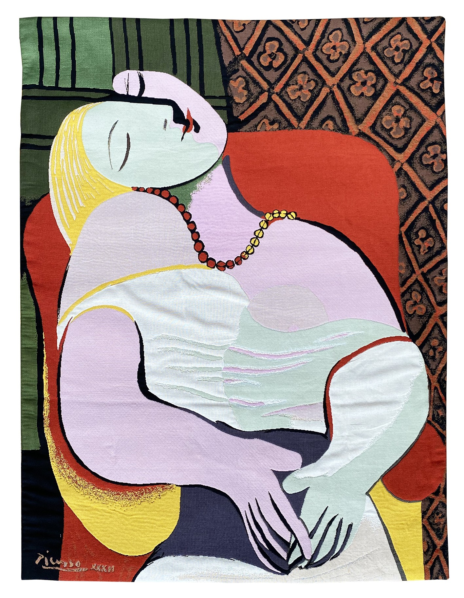
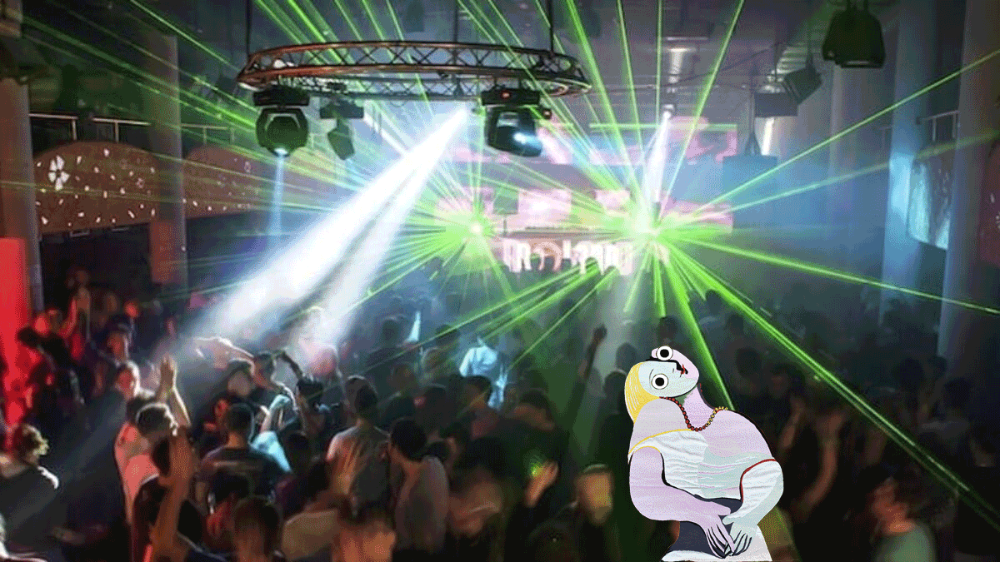
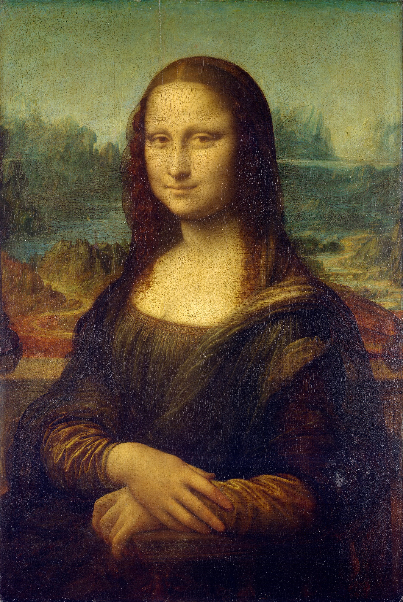
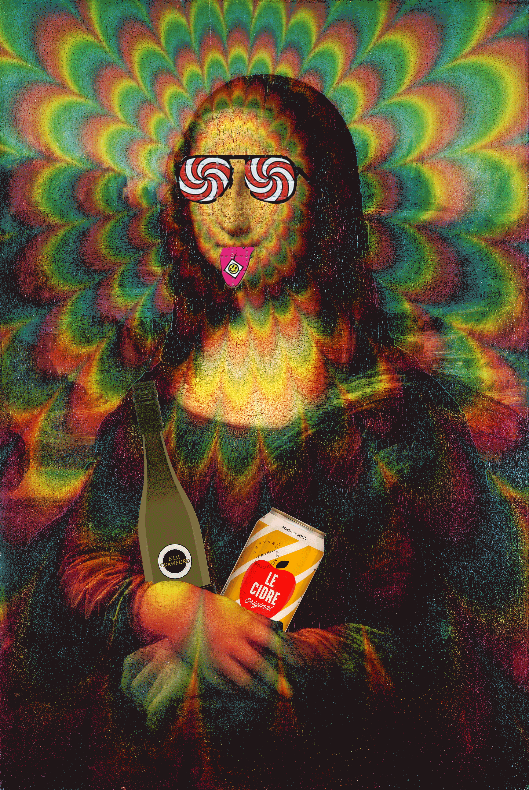
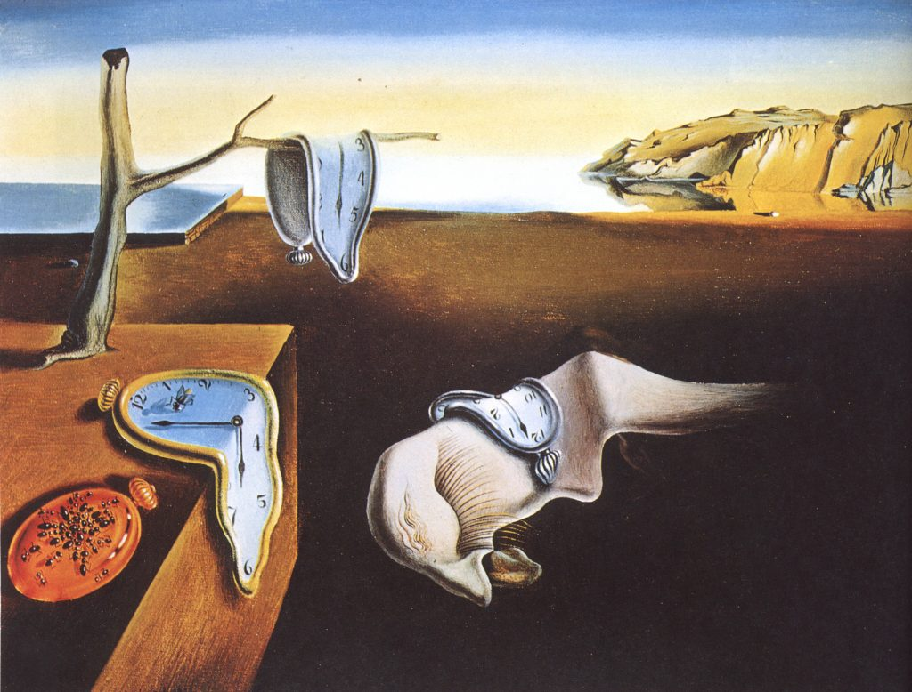
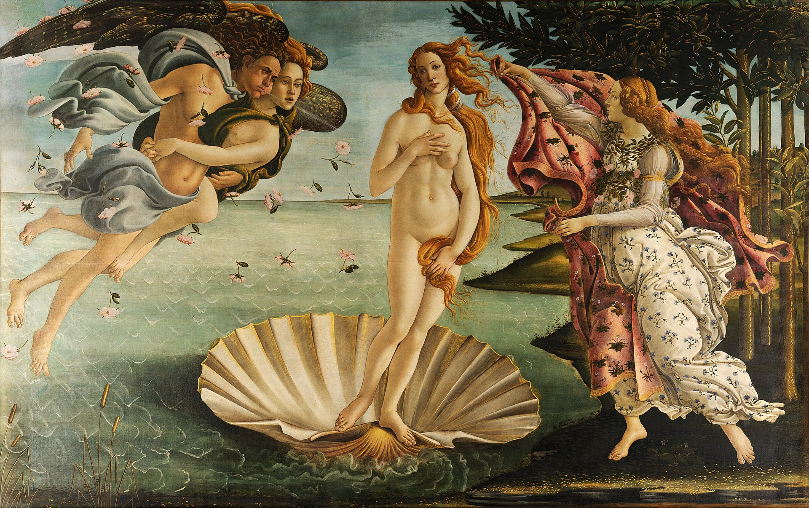
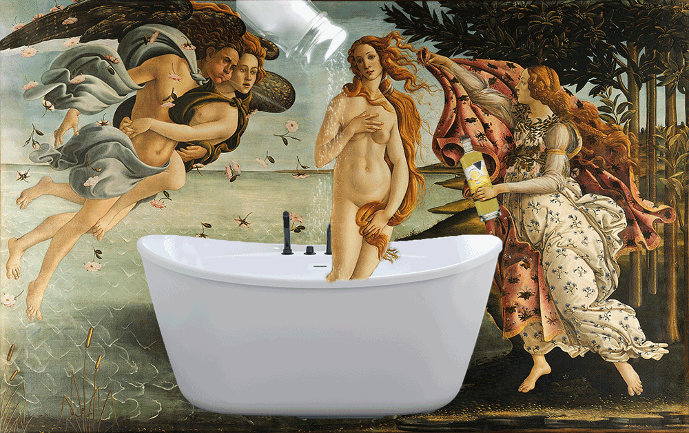

# Exposition Virtuelle: Prohibition Artistique #
Peu de gens savent que l’art a longtemps été censuré au niveau festif. C’est un fait bien caché, car plusieurs œuvres considérées comme parmi les plus grandioses de l’histoire sont en fait des versions censurées. Si cela se savait, la valeur de ces toiles tomberait à zéro.

Mais comme nous sommes un musée à la recherche de vérité et de vin blanc, voici pour vous 5 toiles originales que vous trouverez assurément encore plus magnifiques que la version popularisée!

## Le Cri d'Edvard Munch ##
Cette toile semblant exprimer l'angoisse et le désespoir n'est en fait qu'un individu sur la meth et le mush.

### Le Cri-stal Meth d'Edvard Mush ###

 

<!-- *********************************************************************************************************************** -->
## Le Rêve de Pablo Picasso ##
Une femme qui dort paisiblement? Non, pas vraiment. C'est plutôt le party de l'année!

### Le Rave de Pablo Ecstaso ###

 

<!-- *********************************************************************************************************************** -->
## Mona Lisa de Leonard Davinci ##
Son regard et sourire énigmatiques ont toujours été un mystère pour tous, mais une fois la peinture en contexte, on comprend mieux ce que voulait nous dire Davinci: Festoyons!

### Mona LiSDa de Leonard Davincidre ###

 

<!-- *********************************************************************************************************************** -->
## Persistance of Memory de Salvador Dali ##
Coup de maître de Dali d'avoir réussi à garder presque complète sa toile face à censure. Par contre, enore aujourd'hui on se demande s'il s'agit d'une image sortie de son imagination, ou simplement un vision lors de ses soirées Horloges et Mescaline.

### Persistance of Mescaline de Salviador Dali ###

 

<!-- *********************************************************************************************************************** -->
## The Birth of Venus de Sandro Botticelli ##
La naissance de Venus ne faisait pas vraiment de sens, alors qu'elle apparaît déjà adulte avec les cheveux longs et les *boobs* à l'air. Mais tout prend son sens lorsqu'on sait bien qu'on ne commence vraiment à vivre qu'après avoir brossé sur les sels de bain.

### The Bath of Venus de Saltro Limoncelli ###

 

[Retour à la page d'acceuil](index.md)
